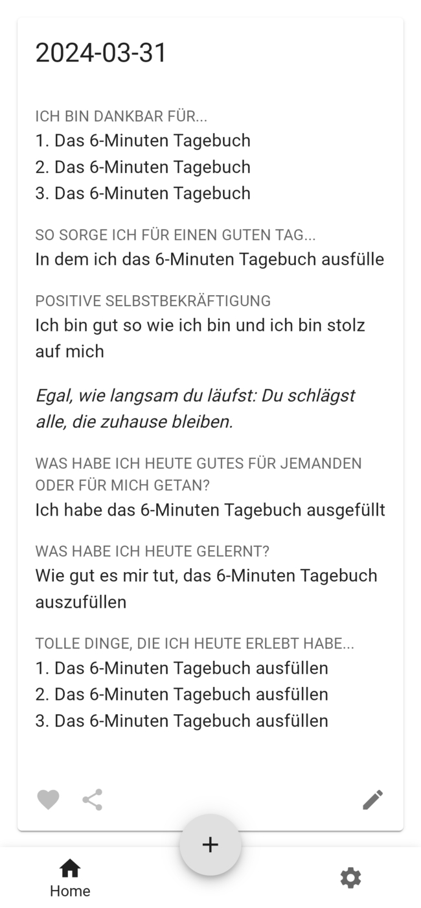
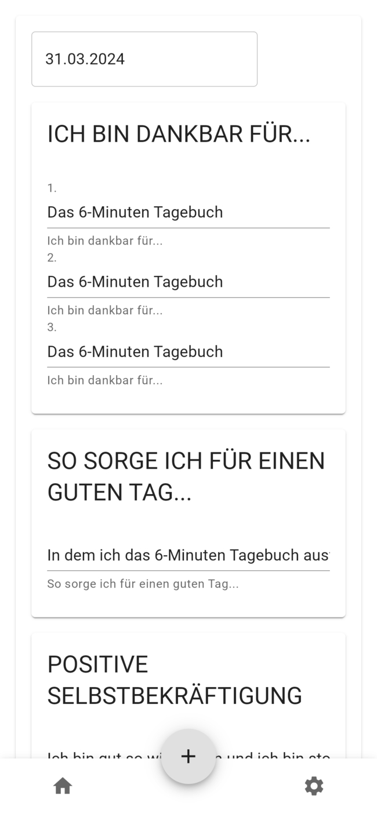
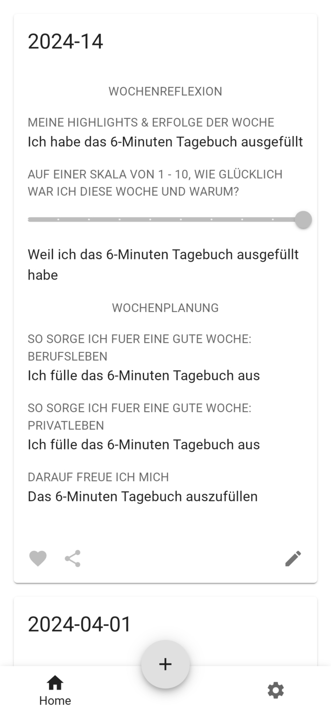
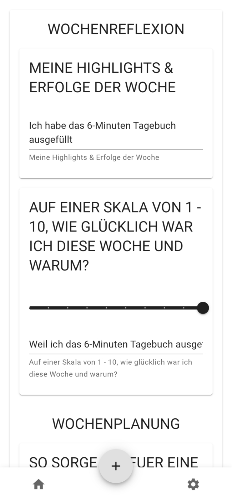
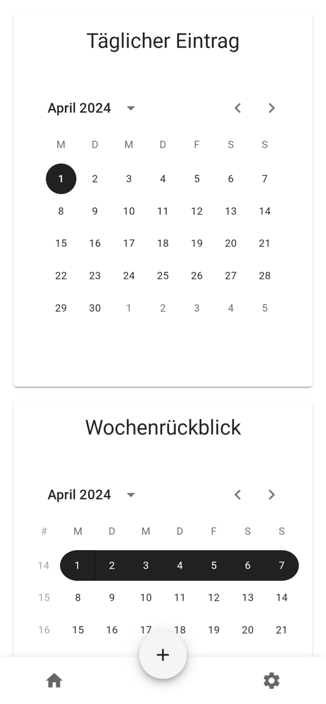

# 6-Minuten-Tagebuch

> [!NOTE]
> **Inoffizielle** digitale Version des [6-Minuten Tagebuch](https://6minutenverlag.de/products/das-6-minuten-tagebuch?utm_source=google&utm_medium=cpc&utm_campaign=DE%20|%20Brand%20|%206-minuten&utm_term=6%20minuten%20tagebuch&gad_source=1&gclid=CjwKCAjwtqmwBhBVEiwAL-WAYd4h3qo6OoUuQhXtqd234loTh-7LpDRl9rnzqXWDh_w_9sDbAI4JRxoCXf4QAvD_BwE).


## Was kann die digitiale Version?

Die digitale Version besteht aus einem React Frontend sowie einem FastAPI/Python Backend. 

Das Backend speichert die Einträge im JSON Format, sodass diese auch ohne die App weiter nutzbar sind. Die Daten bleiben also in deinen Händen.

```
# JSON basiertes Dateiformat
data/user
|-- daily
|   |-- 2024-03-01.json
|   |-- 2024-03-05.json
|   |-- 2024-03-06.json
|   |-- 2024-03-07.json
|   |-- 2024-03-31.json
|   `-- 2024-04-01.json
`-- weekly
    `-- 2024-14-1.json
```

Über das Frontend können Einträge angelegt, bearbeitet und angesehen werden. Es besteht aus:
- Einer Login Seite
- Einer Übersichtsseite, welche einen Zeitstrahl mit allen Einträgen anzeigt
- Einer Seite mit Kalenderansichten zum Anlegen eines neuen täglichen oder wöchentlichen Einträge
- Einer Seite zum Bearbeiten der täglichen und wöchentlichen Einträge

### Screenshots
<details>
  <summary>Täglicher Eintrag</summary>
    
  #### Täglicher Eintrag
  Buch             |  Übersicht | Bearbeiten
  :-------------------------:|:-------------------------:|:-------------------------:|
   |  | 
</details>

<details>
  <summary>Wöchentlicher Eintrag</summary>
  #### Wöchentlicher Eintrag
  Buch             |  Übersicht | Bearbeiten
  :-------------------------:|:-------------------------:|:-------------------------:|
   |  | 
</details>

<details>
  <summary>Monatlicher Eintrag</summary>
  #### Monatlicher Eintrag
  
  Buch             |  Übersicht | Bearbeiten
  :-------------------------:|:-------------------------:|:-------------------------:|
   | *Die monatlichen Einträge sind noch nicht implementiert.* | *Die monatlichen Einträge sind noch nicht implementiert.*
</details>

<details>
  <summary>Neuen Eintrag anlegen</summary>
  #### Auswahl der Eintragsart
  
  Täglich | Wöchentlich |  Digital
  :-------------------------:|:-------------------------:|:-------------------------:|
   |  |  
  
  > [!NOTE]
  > Die monatlichen Einträge sind noch nicht implementiert.
</details>

## Installation
```shell
# Klone Repository
https://github.com/MarcelBruckner/6-Minuten-Tagebuch.git
cd 6-Minuten-Tagebuch

# Anpassen der Environment Variablen
nano .env

# Build and run
docker compose up --build -d
```

## Tech Stack

Frontend | Backend
:---|---:
[TypeScript](https://www.typescriptlang.org/) | [Python](https://www.python.org/)
[OpenAPI](https://www.openapis.org/) | [OpenAPI](https://www.openapis.org/)
[React](https://react.dev/) | [FastAPI](https://fastapi.tiangolo.com/) 
[React Router](https://reactrouter.com/en/main) |
[React Material UI](https://mui.com/) |

## License

MIT License

Copyright (c) 2024 Marcel Bruckner
